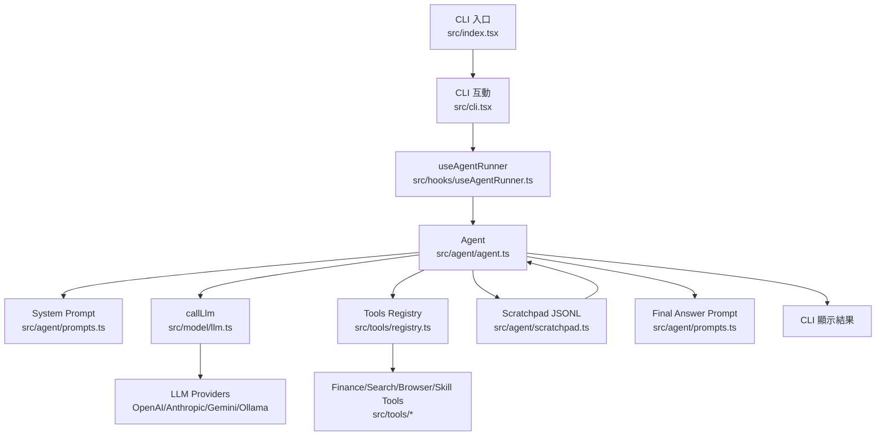

# Dexter 架構圖

```mermaid
flowchart TD
  A[CLI 入口
src/index.tsx] --> B[CLI 互動
src/cli.tsx]
  B --> C[useAgentRunner
src/hooks/useAgentRunner.ts]
  C --> D[Agent
src/agent/agent.ts]
  D --> E[System Prompt
src/agent/prompts.ts]
  D --> F[callLlm
src/model/llm.ts]
  F --> G[LLM Providers
OpenAI/Anthropic/Gemini/Ollama]
  D --> H[Tools Registry
src/tools/registry.ts]
  H --> I[Finance/Search/Browser/Skill Tools
src/tools/*]
  D --> J[Scratchpad JSONL
src/agent/scratchpad.ts]
  J --> D
  D --> K[Final Answer Prompt
src/agent/prompts.ts]
  D --> L[CLI 顯示結果]
```
